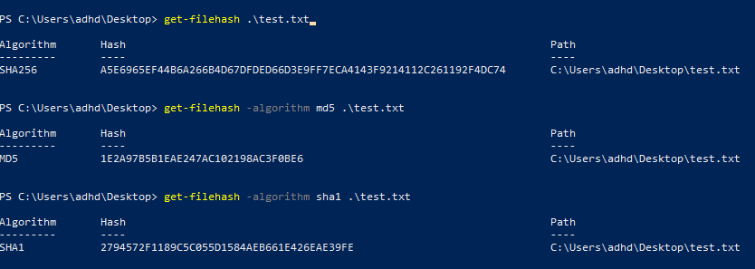

# Manual Artifact Collection Process
1. **Gather email artifacts:**

-  **Sending Address**
-  **Subject Line**
-  **Recipients** ( Unless they are in BCC )
-  **Date and Time**

These can be identified using typical email clients such as Outlook and Thunderbird. Additionally, text editors such as Sublime and Notepad++ can be used to retrieve theses items as well. 

We can quickly identify our artifacts using a text editor as shown above. These items were retrieved using Notepad++ and analyzed after downloading the email to an .eml format.

2. **Find and identify the Sending Server IP** (server which has sent the email).

*The sending IP address can be found by searching for `IP` in the editor.* To evaluate an EML file and identify the sending server's IP address, you typically need to examine the email headers. Email headers contain a lot of metadata about the email, including information about the servers involved in transmitting the email.

Look for the headers section, which usually begins with "`Received`:". Each "Received:" header represents a step in the email's journey from the sender to you, and the IP addresses of the servers involved are often listed there.

*You can search for the last "`Received`:" header, as it typically contains the IP address of the server that initially received the email from the sender.* Sometimes, there might be multiple "`Received`:" headers, especially if the email passed through multiple servers. In that case, you'd need to trace back through the headers to find the IP address of the sender's server.

Searching for the value `Sender` may help identify the IP address of the sender as well.

Now that we have the IP, we need to convert the address into a hostname. This can be accomplished by performing a reverse DNS Lookup. Let's use the free online service by Domain Tools – [https://whois.domaintools.com/](https://whois.domaintools.com/). If we input the sending server IP we just received  we can retrieve information about the server.

Our server domain address is much different than the address found here. This is an indicator that the domain has been spoofed.

3.  **Find and Search for Reply -To address** ( where any replies will be sent).

The address above will receive any replies to this email. Again, this is another indicator that something isn't quite right as the reply-to address doesn't match the domain of the sender. 

4. **Collect and Extract web artifacts and links**

The term “web artifact” is used to describe a hyperlink in an email that will redirect the recipient to a domain, an IP address, or a specific URL. These can be used to host fake login portals that steal any entered credentials or pages that host malware which is downloaded when the site is visited. Collecting these artifacts is extremely straightforward and can be done in just a few clicks. We are looking to retrieve:
	- **The full URL** (the complete web address as it is sent in the email)
	- **The root domain** (only the domain name, not including specific pages)

**Text Editor Extraction**

In a text editor, we can use the CTRL+F keyboard shortcut to enable the “Find” feature. There are three quick ways to find the URL(s) we want:

- **Search for “http” as this will identify any http or https addresses being mentioned within the email.**
- **Search for anchor HTML tags `<a>` which are used to perform hyperlinking.
- **Search for the text from the email body that is a hyperlink, in this example, we could search for “you can cancel it”.**

We’re going to use the first method.

As you can see, this is a much safer method than interacting with the email client. We can copy the link without the fear of clicking on the link and being taken to a malicious site.

5. **Identify any attachments and create hash values for file artifacts**

Attachments can be identified in the text editor by searching for `filename` or in the client by carefully hovering over the attachment.

We need to collect file hashes of malicious attachments to perform reputation checks and implement defensive measures. Hashes are the output of a hashing algorithm, such as MD5 (Message Digest 5) or SHA (Secure Hash Algorithm). These algorithms will produce a unique string that is used to represent the file. If there is a single change to the file, such as editing a text file and changing one character, the hash will be completely different. You can read more about hashes [here](https://www.sentinelone.com/blog/what-is-hash-how-does-it-work/).

The Linux commands are as follows:

- `sha256sum <file>`
- `sha1sum <file>`
- `md5sum <file>`

Similarly, we can retrieve the MD5 and SHA1 values in Windows PowerShell as well using the `get-filehash` command with the `-Algorithm` switch.

Whilst typically generating MD5 and SHA1 hashes are enough to perform reputation searches online and take defensive measures within endpoint detection and response (EDR) platforms, some services such as Talos File Reputation require SHA256 hashes to perform checks against their databases. It’s useful to know how to generate all three both in Windows and Linux.

